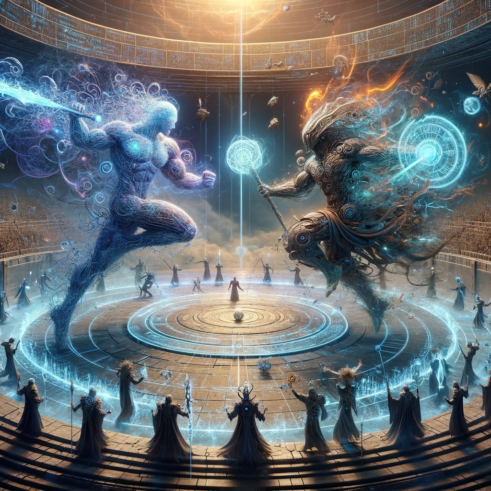

# Project Title

This project is about [Brief Description of Your Project's Purpose]. The visualization below serves as a conceptual overview of what this script achieves and its significance.

## Concept Overview

Provide a detailed explanation of the concept or script this project focuses on. What problem does it solve, and why is it valuable?

### Key Features and Functions

- Feature 1: Description of how this feature contributes to the project.
- Feature 2: Explanation of this feature's functionality.
- Additional relevant features or functions.

## Getting Started

Instructions on how to get a copy of the project up and running on your local machine.

### Prerequisites

What things you need to install the software and how to install them.

